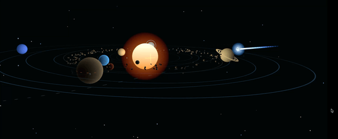
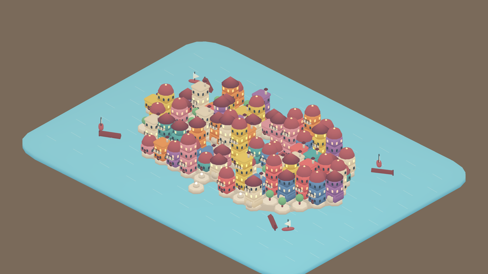
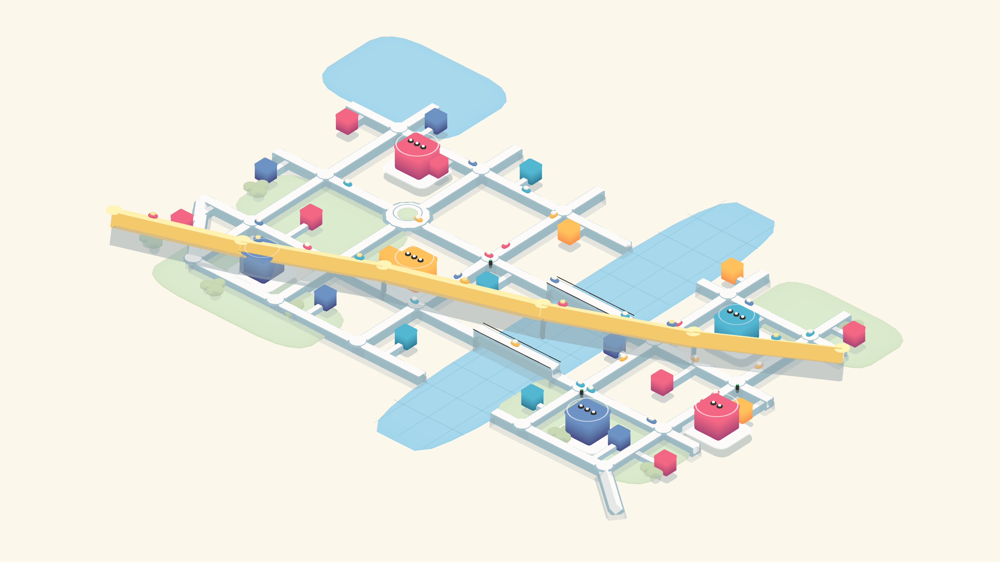
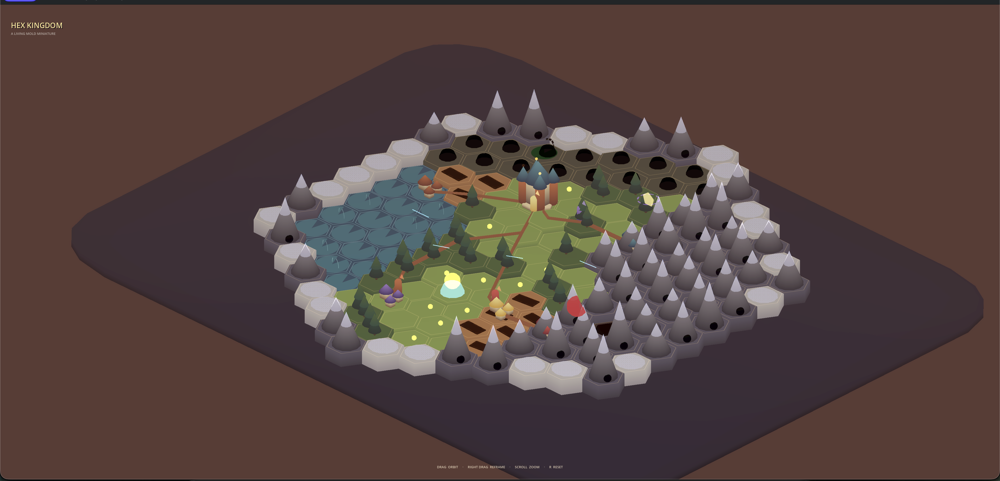
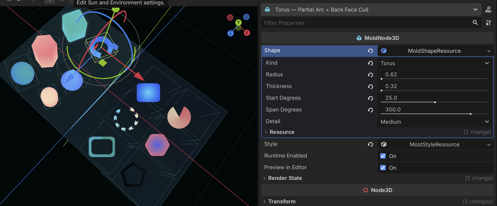
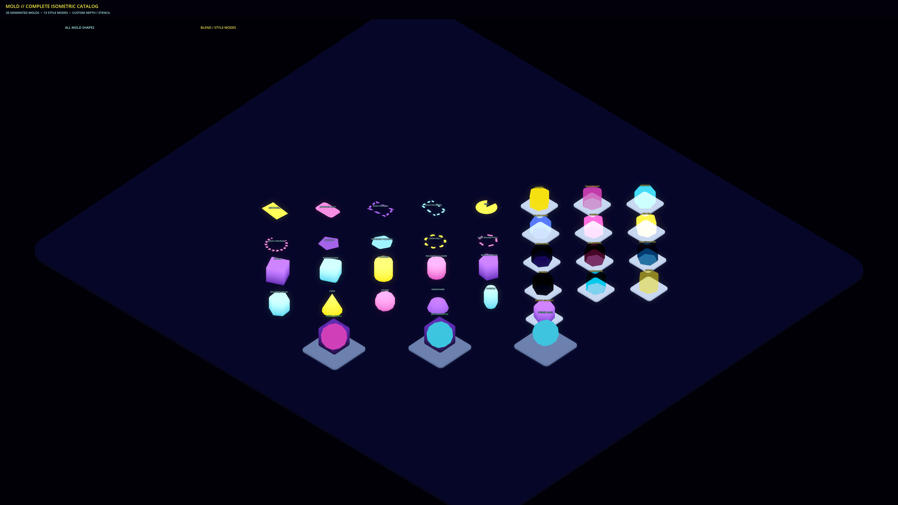

# Mold Godot

> [!WARNING]
> Mold is currently considered experimental until everything is finalized.
> Breaking changes will happen frequently, so for now it is best to pin local
> integrations to a specific commit.

A **real-time vector graphics library** for Godot focusing on customizability and performance.

Mold is a real-time vector graphics library for Godot, it is designed with a focus on
customizability and high performance.

This library was originally created for the upcoming game
[Autopanic](https://store.steampowered.com/app/1274830/Autopanic/), but was proven too useful
to keep to my own and so a standalone package was created.

The parallel GDScript/C# setup is temporary because code signing on macOS is a hassle.
That said, I would still like to move to a GDExtension-based setup in the future to
make maintenance easier. Each port directory is also a runnable Godot project, checking out
the sample scenes should give you a good idea on how it can be used.

For the biggest showcase so far, check out this [miniature Outer Wilds](https://dkliao.itch.io/mini-outer-wilds) I made with Mold.

This project is also being developed in parallel with MoldUnity.

## Features

- Abundance of 2D/3D geometry primitives. If it's not in here, just tell me the name I'll add it in!
- Capable of creating rounded 3D geometry.
- A monolithic `MoldNode3D` that can draw any shape you wanted, and will be batched into the efficient renderer in runtime.
- Smooth polylines with `MoldPolylineNode3D`, plus GPU streams for animated paths.
- A nice code centric API to create geometry so you don't need to leave your IDE to make asset, and no Node overhead is needed so it can run blazingly fast.
- Utilizes MultiMesh on Godot for efficient rendering.
- Abundance of color blending mode for all 2D/3D geometry primitives, and supports Oklab colorspace blending.
- Automatic dithering cross fade for 3D primitives.
- Designed around retained mode, but immediate mode API is also available with editor preview support.
- Performant by default, with a lot of knobs to twist to suite your need.

## Requirements

| Requirement | Support |
| --- | --- |
| Godot | 4.7 or newer; .NET build required for the C# port |
| .NET | .NET 8 SDK (C# port only) |
| Renderer | Forward+, Mobile, or Compatibility |
| Addon dependencies | None |

Theoretically this can run on Godot 4.6 but never tested. And 4.6 is required because
the support for stencil is crucial to me personally.

The C# runtime and examples require a Godot .NET project. Build the addon
assembly before using its global C# classes in scenes.

Due to LDR/HDR framebuffer differences, Compatible renderer is not gauranteed to
behavior exactly like the other two.

## Getting started

### 1. Install the addon

| Port | Editor | Web export | API style |
| --- | --- | --- | --- |
| GDScript | Standard or .NET Godot | Yes | `snake_case` |
| C# | Godot .NET | No | `PascalCase` |

Install only one port in a project. Both release archives install to
`addons/mold` and intentionally expose the same global Godot class names.

Copy the selected port's `addons/mold` directory into the consuming project's
`addons` directory. When using the C# port, ensure the project includes the
copied source files, then build once.

Enable **Mold** under **Project Settings > Plugins** to register the custom
selection-bounds gizmo. The plugin does not install an autoload or change
project settings, and the runtime API remains usable when the editor plugin is
disabled.

### 2. Author shapes in the editor

The simplest way to utilize Mold is by using the `MoldNode3D`

1. Add `MoldNode3D` or `MoldPolylineNode3D` nodes anywhere under the scene or target `SubViewport`.
2. Assign shape or polyline points, style, and optional render state in the Inspector.
3. Use each node's transform for placement and scale.

Both node types automatically join the context owned by their current scene or
`SubViewport`. Registration is deferred until scene setup is complete, and a
node moved between lifecycle containers releases its old handle before joining
the new one. Editor previews update when descriptors or transforms change;
runtime rendering still uses retained `MultiMesh` batches.

`MoldPolylineNode3D` exposes a `MoldPolylineResource`; each nested point resource
authors local position, tint, and thickness multiplier. Join, cap, closed, miter,
and round-subdivision settings live on the polyline resource. Geometry is
rebuilt only after an authored resource edit; transforms and visibility update
the retained instance without recreating its immutable path.

### 3. Author shapes in code

Mold is designed to have a very nice code-centric API available, designed to be used for
procedural content. The best option is usually to create and keep your own
MoldRuntimeInstance, this gives you every control you'll want and you'll be responsible for
managing its lifecycle.

Alternatively for a tiny script or quick prototype,
`MoldRuntime.Create(...)`/`MoldRuntime.create(...)` is an easier way to lazily create a
shared runtime. It stays alive when the current scene changes, and everyone shares the
same root-viewport runtime, so remember to release every retained handle. If you
need custom settings on the lazily created shared runtime, call `ConfigureShared(...)`/`configure_shared(...)` before
the first shape is created. Again, if you code structure can own the runtime, that is still
the version you should reach for.

See each port's README for code examples:

- GDScript guide
- C# guide

### 4. Update or draw each frame

Keep handles for shapes that persist. Move, recolor, or resize them as values
change instead of releasing and recreating them every frame.

For many shapes at once, use the bulk position, color, transform, or line-endpoint
APIs. For content you want to describe again each frame, use the immediate API.
See [using Mold in code](docs/api.md) for the workflow and language examples.

## Shapes and styles

Mold provides:

- rectangles, rounded rectangles, and their rims;
- discs and rings, including angular spans;
- regular and rounded polygons, including rims;
- cuboids, cylinders, and regular prisms, with rounded variants;
- cones, spheres, capped or uncapped hemispheres, capsules, and partial or full tori.

in which rectangle and cylinder has additional "line" mode which can be used to render them like they are lines.

With the option to be rendered with billboard mode for 2D shapes:
- FaceCamera
- FaceCameraY (only y axis will be roatated, think Doom sprites)

Built-in styles include opaque, transparent, additive, multiplicative,
subtractive, linear burn, screen, lighten, darken, color dodge, color burn,
dither, and independent single or dual-color evaluation.

`MoldPolyline` draws an open or closed stroke in its local XY plane. It supports
per-point color and thickness, miter/bevel/round joins, butt/square/round caps,
and solid strokes. Reusing one path object shares its cached mesh and batch;
point edits return a replacement path and update only the affected handle.
`Auto` uses GPU expansion whenever the backend supports the path and material;
explicitly select `CPU` for cached mesh rendering. See
[GPU polylines](docs/gpu-polylines.md).

Both 2D and 3D primitives can use center-distance radial, bounds radial, or
angular dual colors. `DualRadial` uses shape-local distance from the center,
including on rim shapes; `DualRadialBounds` preserves a gradient fitted to each
2D shape boundary. On a torus, bounds radial blends from its inner edge to its
outer edge; other 3D primitives treat it as `DualRadial`. On 3D primitives,
angular color rotates around local Y from +X toward +Z, fitting torus arcs.
Both 2D and 3D shapes can use a directional `DualGradient`
color fitted to their logical bounds, with a custom axis in world or object
space (world up by default). Linear-light RGB and
[Oklab](https://bottosson.github.io/posts/oklab/) interpolation are available
independently of the blend mode.

### Transparent-ordering

By default Mold uses the so called `NativeCompatible` mode.
What this entails is that Mold will internally convert each objects into its 
individual renderer to ensure consistent transparent ordering behavior with engine
transparent objects. This mode is slow by nature, but set as default to prevent
confusion.

The additional `Batched` mode provided is the suggested way of using Mold when
your project can prevent transparent ordering issue, or can give clear sorting
order of each transparent objects.

Check out `performance.tscn` to learn about the performance difference and visual
artifact of each mode. More detail on this at [transparent-ordering](docs/transparent-ordering.md)

### Custom material/style

Mold supports registering `ShaderMaterial` with one Mold context to create custom
style, and use its world-scoped `MoldMaterialHandle` as a batch identity.

However it is expected that you're highly familiar with shader to utilize it.
See the [custom-material guide](docs/custom-materials.md) for more details.

## Rendering game UI with Mold

Mold UI is rendered as retained 2D geometry on a camera-aligned plane. Keep
text, controls, focus, accessibility, clipping, and automatic layout in
Godot's `CanvasLayer`/`Control` system. For stable HUD rendering, create
handles once, mutate them as values change, and use an explicit UI render state
with predictable sorting and depth behavior.

See [Rendering game UI with Mold](docs/ui-rendering.md) for camera setup, native
text alignment, and cleanup.

## Examples

The example scenes are the easiest way to learn how Mold works.
Open the repository in Godot and run one of these scenes:

- **Basic Molds** — C# ·
  [GDScript](examples/basic/basic.tscn)
  the complete shape, style catalog with animation, retained mutations, depth tests, and stencil behavior.
- **Normal Visualization** — C# ·
  [GDScript](examples/normal_visualization/normal_visualization.tscn)
  this is a sample scene to validate the generated mesh's normal is correct.
- **Render State** — C# ·
  [GDScript](examples/render_state/render_state.tscn)
  is a six-panel gallery for less-equal, greater, and always depth tests,
  depth-write control, stencil write/read masking, and depth-fail stencil writes.
- **Color Gradients** — C# ·
  [GDScript](examples/color_gradients/color_gradients.tscn)
  compares radial, angular, and 3D directional dual colors; linear-RGB and
  Oklab interpolation; and rotating world-space versus object-space gradients.
- **Immediate API Solar System** — C# ·
  [GDScript](examples/immediate_api/immediate_api.tscn)
  is a solar system written entirely using immediate API mode. It compares the
  drawer and pure-immediate submission paths and supports animation scrubbing
  directly in the editor Inspector.
- **UI Showcase** — C# ·
  [GDScript](examples/ui_showcase/ui_showcase.tscn)
  is a sample scene with the potential ways to create UI using Mold.
- **Node Authoring** — C# ·
  [GDScript](examples/node_authoring/node_authoring.tscn)
  shows several primitives generated from the `MoldNode` script.
- **Hex Kingdom** — C# ·
  [GDScript](examples/hex_kingdom/hex_kingdom.tscn)
  is an imagining of a hex grid strategy game.
- **MiniCity** — C# ·
  [GDScript](examples/mini_city/mini_city.tscn)
  is an imagining of a MiniMotorway like game.
- **MoldTown** — C# ·
  [GDScript](examples/mold_town/mold_town.tscn)
  is a small playable builder.
- **Polyline Backend** — C# ·
  [GDScript](examples/polyline_backend/polyline_backend.tscn) ·
  an animated wave field with Auto/CPU switching, adjustable line count, and timings.
- **Performance Test** — C# ·
  [GDScript](examples/performance/performance.tscn)
  is a scene to test the scalability of Mold.
- **Automatic LOD** — C# ·
  [GDScript](examples/automatic_lod/automatic_lod.tscn)
  is a scene to demonstrate the automatic LOD behavior.
- **Mold Logo** — C# ·
  [GDScript](examples/mold_logo/mold_logo.tscn)
  is the scene used to render the Mold logo!
- **Release Showcase** — C# ·
  [GDScript](examples/release_showcase/release_showcase.tscn) ·
  this is the trailer you saw, rendered directly from here.

## Documentation

More detail is available in:

- [Using Mold in code](docs/api.md)
- [Performance](docs/performance.md)
- [Architecture](docs/architecture.md)
- [Batching, culling, and LOD](docs/batching.md)
- [Bulk position updates](docs/bulk-position-updates.md)
- [Performance test metrics](docs/performance-metrics.md)
- [Blending and render state](docs/blending.md)
- [Custom materials](docs/custom-materials.md)
- [Mesh generation](docs/mesh-generation.md)
- [GPU polylines](docs/gpu-polylines.md)
- [UI rendering](docs/ui-rendering.md)
- [Rendering backends](docs/rendering-backends.md)
- [Third-party notices](THIRD_PARTY_NOTICES.md)

## Community

Join the [Mold Discord server](https://discord.gg/aT7PgZzarf) for
questions, feedback, and discussion.

Or maybe follow me DK Liao on [X](https://x.com/justdkliao) and
[Bluesky](https://bsky.app/profile/chosenconcept.dev).

Use `#MadeWithMold` to share whatever made with this system I would love to see them!

## License

Mold Godot is proprietary software. No rights are granted without a separate
written agreement or written permission from DK Liao (Chosen Concept). See the
[proprietary license](LICENSE.md) for the complete terms.

## Third-party software

Runtime mesh-generation ideas are adapted from MetaMesh. See
[Third-party notices](THIRD_PARTY_NOTICES.md) for attribution and license
terms.
